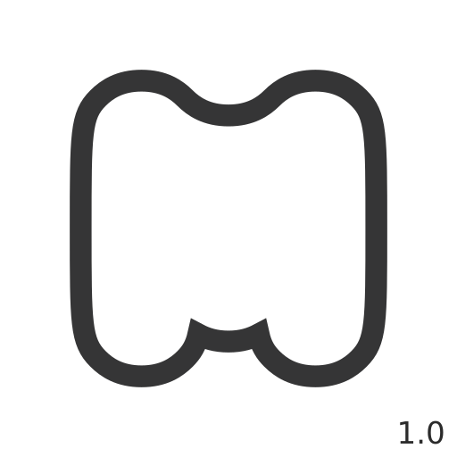

# Minimal Master

This is a GitHub mirror of the Minimal Master browser extension, originally created by [Edouard Mathieu](https://gitlab.com/eedomus). The original project is hosted on [GitLab](https://gitlab.com/eedomus/minimal).

## About Minimal Master
A browser extension that makes web interfaces more minimal and helps you focus on content. It works on various websites like YouTube, Twitter, Reddit, Amazon, Yahoo, Google, and Netflix.

### Key Features
- Removes distracting elements from popular websites - no more algorithms feeding you content!
- Simplifies YouTube homepage with a clean search interface
- Hides sidebars, notifications, and other distracting UI elements
- Makes websites more focused on content

### Improvements Since Mirror:
- Added a cleaner YouTube homepage replacement
- Removed tabs notifying you on Reddit and YouTube
- Improved Reddit minimalism
- Fixed and cleaned up a number of visual improvements across YouTube and Reddit

## Original Project
This repository maintains the GPL v3 license of the original project. All copyright notices and attributions have been preserved.

## License
GNU General Public License v3 - see the [LICENSE](LICENSE) file for details.



# Minimal, the browser extension for peace of mind
Minimal is a browser extension to experience a minimal, less attention grabbing internet experience. Internet should be a tool, not a trap.

You can watch the Minimal introductory video [here](https://youtu.be/Gtf9DYDtsHw)

Minimal is driven by core values:

- The user must actively make choices by themselves.
- A user should easily find the content they are searching for on a page, not the content a platform wants them to see.
- A service provider can convince the user to use their platform, but only through their services' inner quality.

[](https://addons.mozilla.org/firefox/addon/minimal-internet-experience/)

To get a complete list of the changes made to the user experience by the minimal browser extension, check the [Changes page](https://minimal.aupya.org/#about_changes). Those changes are following [minimal's manifesto](MANIFESTO.md).

This extension is being developed for the greater good, it is an open source project, you can check its code and contribute.

Some details to know:
 - All product and company names are trademarks™ or registered® trademarks of their respective holders. Use of them does not imply any affiliation with or endorsement by them.

 - This program is distributed in the hope that it will be useful, but WITHOUT ANY WARRANTY; without even the implied warranty of MERCHANTABILITY or FITNESS FOR A PARTICULAR PURPOSE. See the GNU General Public License for more details.

 - Minimal is fully transparent about what it does once installed, being open source and well documented (see the [Changes page](https://minimal.aupya.org/#about_changes) ). Minimal has no effect on the website themeselves, minimal is an add-on that allows you to customize your experience while browsing on the internet.

 - Minimal does not collect any data.
 
 - Your browser will require you to add permissions for minimal to access any website. Those permissions are necessary for minimal to be able to add the stylesheets and the scripts needed for its functioning. If this requirement frighten you, it's a good thing, you should not accept to give permissions that easily. In the case of Minimal, you should know that it is an open-source add-on, everyone is free and invited to check its source code and see that it's never collecting or sending anything.

# Want to contribute?

We would be more than happy to receive some more help from the community:

## As a user
If you spot something that you think minimal should act upon on a common website let us know by creating a ticket [here](https://gitlab.com/aupya/minimal/issues).

If you encounter any problem while using minimal, please create a new [issue](https://gitlab.com/aupya/minimal/issues).

## As a (web)designer
If you have ideas about what a common website should look like or act like for it to be minimal, please, add your ideas [here](https://gitlab.com/aupya/minimal/issues). 
Please, try to follow [minimal's manifesto](./MANIFESTO.md).

## As a (web)developer
This is a browser extension, if you are not familiar about how it works, [here is a guide](https://developer.mozilla.org/en-US/docs/Mozilla/Add-ons/WebExtensions).

When contributing, if you make a new change, add a comment to explain it.

The comment has to fit on one line and has to follow this pattern:
1. `/* - ` 
2. The explanation of the change
3. ` - ` 
4. One or more code of a rule from the [manifesto](./MANIFESTO.md)
5. ` */`

Changes must follow at least one rule from the [manifesto](./MANIFESTO.md). Rules codes are the first letter of a main section followed by the number of the rule. Multiple codes can be specifed, separated by spaces.

Exemples of the comment pattern:

```
/* - Explaination of the change - C3 P1 */
```
```
/* - Explaination - U2 */
```

# How to build the extension?

Put everything inside a .zip and you should be able to use it [as described here](https://developer.mozilla.org/en-US/docs/Mozilla/Add-ons/WebExtensions/Your_first_WebExtension#installing).
